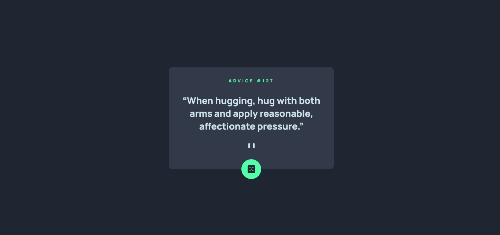
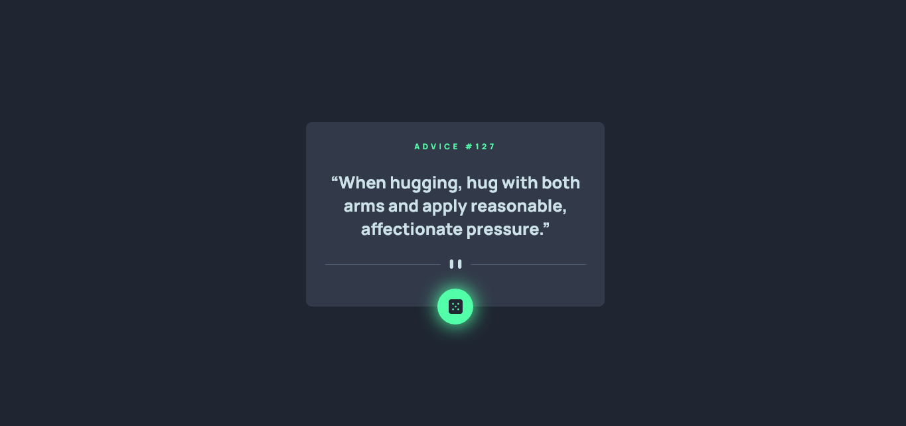

# Frontend Mentor - Advice generator app solution

This is a solution to the [Advice generator app challenge on Frontend Mentor](https://www.frontendmentor.io/challenges/advice-generator-app-QdUG-13db). Frontend Mentor challenges help you improve your coding skills by building realistic projects.

## Table of contents

- [Overview](#overview)
  - [The challenge](#the-challenge)
  - [Screenshot](#screenshot)
  - [Links](#links)
- [My process](#my-process)
  - [Built with](#built-with)
  - [What I learned](#what-i-learned)
- [Author](#author)

**Note: Delete this note and update the table of contents based on what sections you keep.**

## Overview

### The challenge

Users should be able to:

- 

### Screenshot




### Links

- Solution URL: [code](https://github.com/daishek/FrontendMentor/tree/main/advice-generator-app-main)
- Live Site URL: [live](https://daishek.github.io/FrontendMentor/advice-generator-app-main/)


## My process

### Built with

- HTML5
- CSS
- JavaScript
- 
### What I learned

How to fetch Api

```js
const get_advice = async () =>{
    const res = await fetch('https://api.adviceslip.com/advice')
    const data = await res.json()
}
```
## Author

- Frontend Mentor - [@daishek](https://www.frontendmentor.io/profile/daishek)
